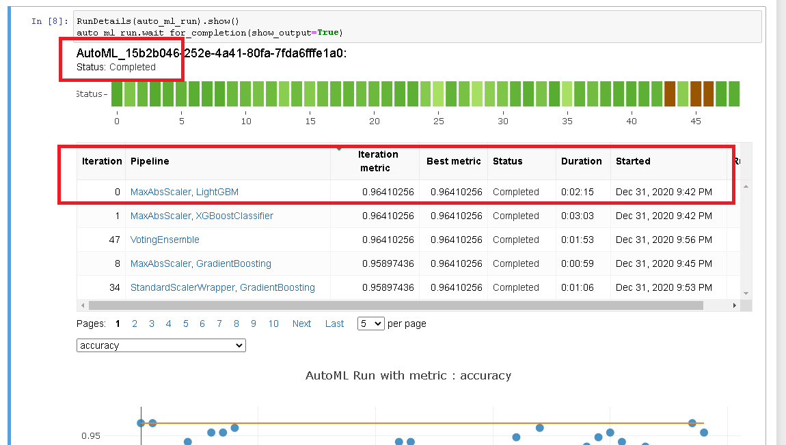
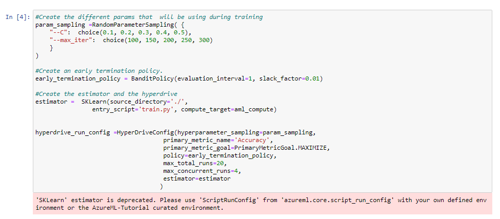
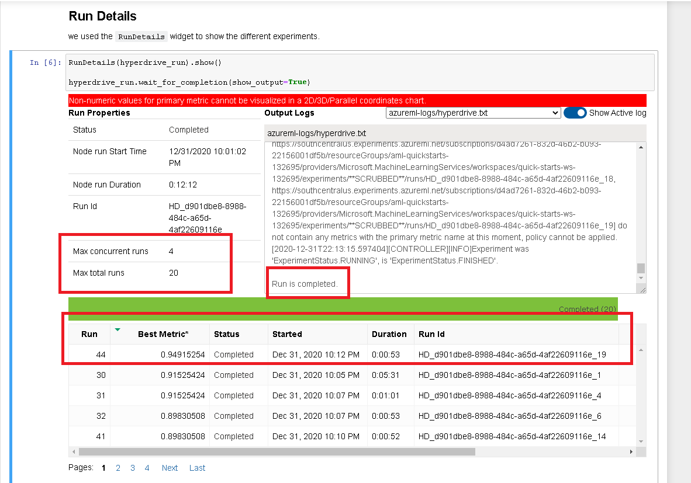

# Parkinson detection (from data to the model deployment) using Azure Machine Learning  

## Summary of the project
**This project is part of the Udacity Azure ML Nanodegree.**

In this project, we had the opportunity to use the knowledge we obtained from the Nanodegree to solve the problem of our choice. 
Where We start by creating two models: one using Automated ML and one customized model whose hyperparameters are tuned using HyperDrive. we then compare the performance of both models and finally deploy the best performing one.

## Dataset

### Overview
Parkinson's disease is a brain disorder that leads to shaking, stiffness, and difficulty with walking, balance, coordination, and talking it may also result in mental and behavioral changes, sleep problems,... (It is important to make an exact diagnosis as soon as possible). Several disorders can cause symptoms similar to those of Parkinson's disease and there are also different ways to do the diagnosis (medical test, response to drug treatment,..) for more information https://www.nia.nih.gov/health/parkinsons-disease#:~:text=Parkinson's%20disease%20is%20a%20brain,have%20difficulty%20walking%20and%20talking

This lead to the main goal of this project which is an attempt to create a classifier to predict if a person has Parkinson disease based on biomedical voice measurements from different people

### Datasource
The dataset used in this project was created by Max Little of the University of Oxford, in collaboration with the National Centre for Voice and Speech, Denver, Colorado, who recorded the speech signals. 

It is composed of a range of biomedical voice measurements from 31 people, 23 with Parkinson's disease (PD). 

Each column in the table is a particular voice measure, and each row corresponds to 195 voice recordings from these individuals ("name" column). 

For more information https://archive.ics.uci.edu/ml/datasets/parkinsons

**NB: The following paper need to be quoted 'Exploiting Nonlinear Recurrence and Fractal Scaling Properties for Voice Disorder Detection', Little MA, McSharry PE, Roberts SJ, Costello DAE, Moroz IM. BioMedical Engineering OnLine 2007, 6:23 (26 June 2007)**

### Task
The main goal of this task is to discriminate healthy people from those with Parkinson disease(PD), according to the "status" column which is set to 0 for healthy and 1 for PD to do this we used different voice measure columns included in the dataset

### Access
The data was loaded first in this repository so that it can be used directly into the different notebook via the link below  https://raw.githubusercontent.com/hananeouhammouch/Parkinsons-detection/master/parkinsons.data

## Automated ML
To configure the Automated ML run we used the setting described below :

|Setting |Reasons ?|
|-|-|
|**experiment_timeout_minutes**|Maximum amount of time in minutes that all iterations combined can take before the experiment terminates (15 minutes because the dataset include only 195 lines)|
|**max_concurrent_iterations**|To help manage child runs in parallel mode, we create a dedicated cluster per experiment, and match the number of this setting (4) to the number of nodes in the cluster(5-1))|
|**n_cross_validations**|Number of cross-validation (5 splits to ensure that they will be no overfitting) |
|**primary_metric**|This is the metric that we want to optimize (accuracy) |
|**task**|Classification |
|**compute_target**|To define the compute cluster we will be using |
|**training_data**|To specify the training dataset stored in the datastore  |
|**label_column_name**|To specify the dependent variable that we are trying to classify |

### Results

Before running, AutoML Start first by checking over the input data to ensure high quality is being used to train the model where he uses class balancing detection, Missing Feature values imputation, and high cardinality feature detection.

After the execution, the AutoML Result not only includes the best model resulting from the running of multiple classification algorithms but also delivers interesting information to understand more why this choice of model was made in this case of problem by learning what features are directly impacting the model and why.

In this case, the best model was generated using MaxAbsScaler LightGBM Algorithm and give us an Accuracy of 0.9641

This experiment can be improved in the future by adding more data in it, giving more time to the run, and also trying deep learning which can deliver a better result

**NB: the result of the experiment is presented bellow with some screenshots** 

*  `RunDetails` execution 

* The Best model selection and registration 

* The Best model from Azure Studio

**NB:to test this Step please run automl.ipynb ** 

## Hyperparameter Tuning

The algorithm we choose for this classification problem is LogisticRegression because we are trying to predict if a patient will have Parkinson's disease based on a range of biomedical voice measurements (yes or no) which means two outcomes.
And To improve the model we optimize the hyperparameters using Azure Machine Learning's tuning capabilities Hyperdrive

First of all, we define the hyperparameter space which means tuning the C and max_iter parameters. In this step, we use random sampling to try different configuration of hyperparameters to maximize the primary metric and to make the tuning more specific

Then we define the termination Policy for every run using BanditPolicy based on a slack factor equal to 0.01 as criteria for evaluation to conserves resources by terminating runs that are poorly performing and ensure that every run will give better result than the one before

Once completed we create the SKLearn estimator

And finally, we define the hyperdrive configuration where we set 20 as the maximum of iteration (why because we don't have a lot of data) and used the element defined above before submitting the experiment

### Results

We run this experiment multiple times and do some tunning to the Hyperdrive configuration to Improve the Accuracy and once satisfied we register our model for future use. In this case the best model was generated using this hyperparameters (C = '0.3', max_iter = '100') and give an Accuracy of 0.949152

This experiment can be improved in the future by adding more data in it, using a different algorithm, and also adding more iteration in the hyperdrive configuration which can deliver a better result

**the result of the experiment is presented bellow with some screenshots** 

* `RunDetails` execution 

* The Best model selection and registration 

**NB:to test this Step please run hyperparam_tuning.ipynb (and place the train.py) in the same directory** 

## Model Deployment
After the execution of the two experiments, we select The best model which was from Auto mL run based on the metric value, and we move then to the deployment and the testing of the Webservice 

The instruction used in this step are described below:

*  Save and register the best model for the deployment, download the conda, set the environment, download the scoring, and set the inference config and the Aci Web service config 

*  Deploy the model as a web service and display the scoring and the swagger URI

*  Testing the web service by first selecting a sample row from the dataset, then dumping the row to JSON format, and finally pass the json row to the web service 

## Screen Recording: https://www.youtube.com/watch?v=bqVxVUk6hys&feature=youtu.be
the Screen recording include :
- A working model
- Demo of the deployed  model
- Demo of a sample request sent to the endpoint and its response
